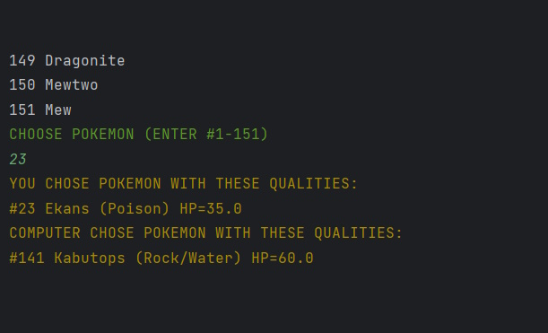
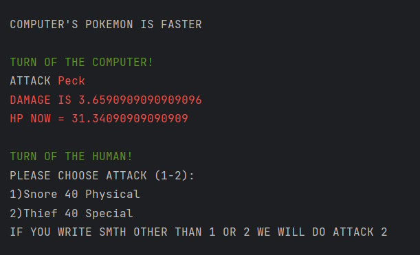
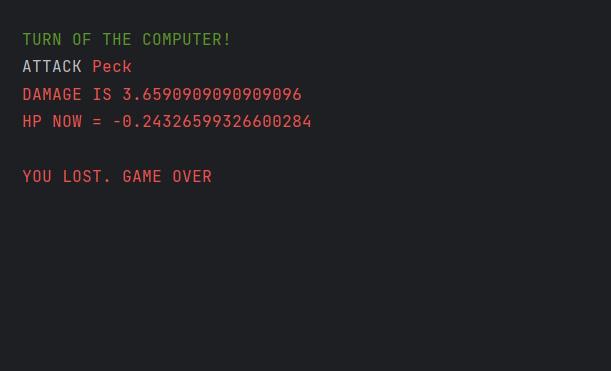

# Java Pokemon Game


## Description
The "Pokemon" game in Java is a console application where you can play against the computer, as explained below:


## Rules
- At the beginning of the game, the user can choose a Pokemon by specifying the serial number or name, which will be selected for battle.
- Display the characteristics and possible attacks of the chosen Pokemon on the console.
- The computer randomly selects an opponent Pokemon.
- After selection, the battle begins.
- The user is presented with two attacks to choose from.
- Damage calculation after each attack.
- The winner is the one who survives the longest.


## Installation and Setup
To install and run the project, follow these steps:

1. Ensure you have [IntelliJ IDEA](https://www.jetbrains.com/idea/) and [Maven 4.0.0](https://maven.apache.org/) installed.
2. Clone the repository:
    ```bash
    git clone https://github.com/IvanSafonov778/Java-Pokemon/
    ```
3. Open the project in IntelliJ IDEA.
4. Import the project as a Maven project.
5. Synchronize Maven dependencies.
6. Adapt the file path in the `FileReader` class to your current setup.
7. Run the `Main` class to start the game.

## Usage Example
Example of using the game:

1. Run the application.
2. Choose a Pokemon by entering its serial number or name.
3. Watch as the computer selects its Pokemon.
4. Choose one of the two available attacks.
5. See the attack result and wait for the next turn.
6. The game continues until one of the Pokemon is defeated.

## License
This project is distributed under a free license.

## Screenshots




## Contact
If you have any questions or suggestions, please contact us at: nerdgoes21@gmail.com.
